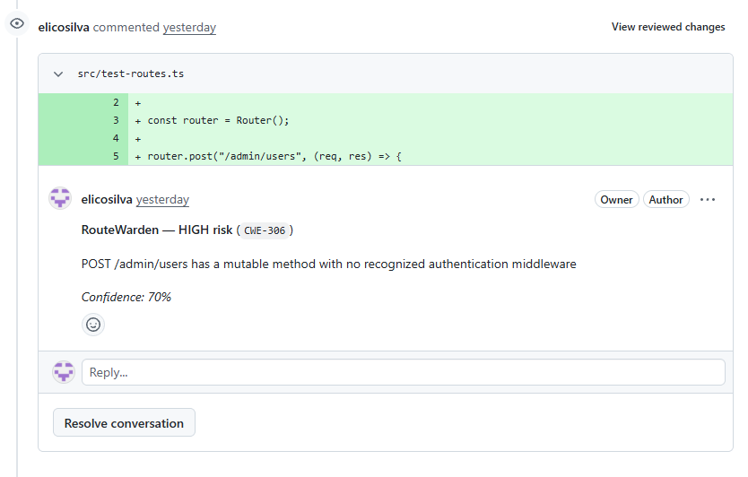
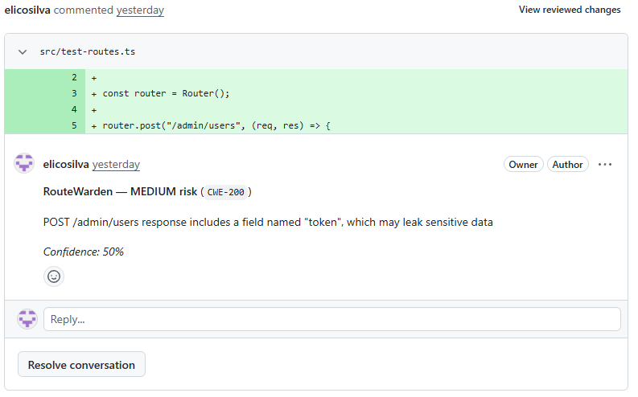

# RouteWarden

**A diff-aware security scanner for Pull Requests.** RouteWarden reads only
the lines a PR actually changed, understands the code's real syntax (not
regex), and flags two specific, high-signal problems in Express, NestJS,
and Next.js apps:

- **Mutable routes with no recognized auth middleware** (`POST`/`PUT`/`DELETE`/`PATCH` — CWE-306)
- **Response payloads that leak sensitive-looking fields** (`token`, `password`, `secret`, `mock`, `bypass` — CWE-200)

It comments inline on the exact line in the PR. It never merges, approves,
or blocks anything — a human always makes the final call.




## Why diff-aware, not full-repo

Most SAST tools scan an entire repository and produce hundreds of findings,
most of which are pre-existing and already triaged (or ignored). RouteWarden
only looks at what a PR is proposing to *add*, cross-referenced against a
real syntax tree (via tree-sitter) of the full file at that commit — never
just the raw diff text, since that alone can't tell a real route definition
from a comment or a string.

## Supported frameworks

| Framework | Detection |
|---|---|
| Express | router.post/get/put/delete/patch(path, ...middleware, handler) |
| NestJS | @Controller() classes with @Get/@Post/@Put/@Delete/@Patch() + @UseGuards() |
| Next.js (App Router) | export async function GET/POST/PUT/DELETE/PATCH in route.ts |


## GitHub Action

The easiest way to use RouteWarden is directly in your GitHub Actions workflow:

```yaml
name: Security

on:
  pull_request:

permissions:
  contents: read
  pull-requests: write

jobs:
  routewarden:
    runs-on: ubuntu-latest
    steps:
      - name: RouteWarden
        uses: elicosilva/RouteWarden@V1
        with:
          github-token: ${{ secrets.GITHUB_TOKEN }}
```
## Auth middleware catalog

RouteWarden ships with a starter catalog of recognized auth patterns
(Clerk, Supabase Auth, Auth0, NextAuth, and a generic bucket), editable at
runtime via rules.yaml — no rebuild required. If your project uses a
custom auth guard, add it there.

Known public auth entry-points (login, register, logout, password reset,
...) are never flagged, even without middleware — you can't require being
logged in to log in.

## Self-hosted server

git clone https://github.com/YOUR_ORG/RouteWarden.git
cd RouteWarden
cp .env.example .env

Edit .env with GITHUB_TOKEN (a GitHub App installation token or PAT) and
WEBHOOK_SECRET (your GitHub App/webhook secret), then:

docker compose up -d

Point a GitHub webhook (or GitHub App) at http://your-server:8080/webhook
for the pull_request event, and RouteWarden starts commenting on new PRs
automatically.

## Architecture principles

- Human-in-the-loop, always. Output is exclusively an inline PR review
  comment. No auto-merge, no auto-approve, ever.
- Deterministic first. Every finding today comes from Go + AST rules — no
  LLM calls anywhere in this version.
- Diff-aware, never a full scan. The engine always fetches the full file
  at the PR's head commit for a valid AST, and cross-references against
  the diff's added lines — it never walks an entire repository.
- Auditable output. Every finding is a structured record — file, line,
  risk, CWE, reason, confidence — never a silent detection.
- Read-only against the scanned repo. The only write RouteWarden ever
  performs is posting a PR review comment.

## Benchmark

RouteWarden includes `cmd/benchmark`, a tool that dry-runs the exact same scan pipeline used in production against hundreds of real, merged pull requests from popular public Express/NestJS/Next.js repositories — with zero write operations, ever. See `benchmark/` for methodology and target repositories.

### Real-World Results

A dry-run benchmark was executed against major open-source Node.js/TypeScript codebases (including `expressjs/express`, `nestjs/nest`, `calcom/cal.com`, `hoppscotch/hoppscotch`, `ghostfolio/ghostfolio`, `documenso/documenso`, `twentyhq/twenty`, and RealWorld example apps):

| Metric | Result |
| :--- | :--- |
| **Pull Requests Scanned** | **822** |
| **Files Analyzed** | **3,320** |
| **Total Findings Identified** | **74** |
| **Severity / Classification** | 100% **HIGH** (`CWE-306`) |
| **Signal-to-Noise Ratio** | **3.6%** of PRs flagged (30 / 822) |

### Key Observations

* **High-Signal Targeting:** 100% of the findings specifically identified **mutable routes (`POST`, `DELETE`, `PUT`, `PATCH`) lacking recognized authentication middleware** — matching the `CWE-306` criteria.
* **Low Noise Rate:** Large core frameworks (such as `nestjs/nest`) yielded a ~1% flag rate, demonstrating that RouteWarden's AST engine effectively filters out non-route changes and avoids spamming developers with false alarms.
* **Rate Limits:** When running historical scans fetching multiple files per PR, pass an authenticated `GITHUB_TOKEN` and use `-delay-ms 1000` (or higher) to respect GitHub's API rate limits.

## AI Agent Skill (Diff-Aware Security Auditor)

RouteWarden provides a native **security agent skill** located at [`.agents/skills/routewarden/SKILL.md`](.agents/skills/routewarden/SKILL.md). It enables AI coding assistants (Google Antigravity, Claude Code, Cursor, VS Code) to perform diff-aware security code reviews directly in your workspace using native bash and git diff capabilities — requiring zero binary setup.

### Automated Security Checks:
- **Express, NestJS & Next.js Security**: Detects unprotected mutable routes (`POST`/`PUT`/`DELETE`/`PATCH`) missing recognized authentication middleware (`CWE-306`).
- **Sensitive Data Leakage**: Flags response payloads exposing sensitive fields such as `token`, `password`, `secret`, `mock`, or `bypass` (`CWE-200`).
- **Diff-Aware Scanning**: Evaluates only modified or added lines in your local working tree (`git diff HEAD`).

### How an Agent Uses This Skill
When an AI agent is asked to perform a "security audit", "route check", or "code review", it automatically activates [`.agents/skills/routewarden/SKILL.md`](.agents/skills/routewarden/SKILL.md) to inspect uncommitted changes against the auth middleware catalog.

### Phase 2 Roadmap (MCP Server)
See [.agents/skills/routewarden/ROADMAP.md](.agents/skills/routewarden/ROADMAP.md) for the technical roadmap on the upcoming native Go MCP Server (`cmd/mcp`), GoReleaser pipeline, and `npx routewarden-mcp` distribution strategy.

## Project layout

pkg/diff/            unified diff parsing (which lines were added)
pkg/github/           GitHub REST API client (fetch, webhook, post comment)
pkg/ast/              tree-sitter parsing + route extraction
pkg/scanner/          cross-references diff-added lines with routes
pkg/scanner/rules/    the detection rules + the auth-middleware catalog
pkg/pipeline/         shared read-only scan core (used by server + benchmark)
pkg/output/           the structured Finding type
cmd/server/           the live webhook receiver
cmd/benchmark/        the read-only benchmark tool

## License

pkg/scanner, pkg/diff, and pkg/ast are licensed under AGPL-3.0 (see
LICENSE).

## Contributing

The easiest way to improve detection accuracy is extending rules.yaml with
your project's auth middleware names or additional public-route keywords —
no code change required.


